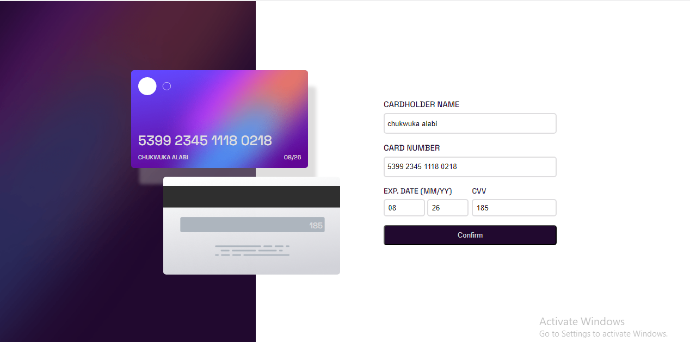

# Frontend Mentor - Interactive card details form solution

This is a solution to the [Interactive card details form challenge on Frontend Mentor](https://www.frontendmentor.io/challenges/interactive-card-details-form-XpS8cKZDWw). Frontend Mentor challenges help you improve your coding skills by building realistic projects.

## Table of contents

- [Overview](#overview)
  - [The challenge](#the-challenge)
  - [Screenshot](#screenshot)
  - [Links](#links)
- [My process](#my-process)
  - [Built with](#built-with)
  - [What I learned](#what-i-learned)
  - [Continued development](#continued-development)
- [Author](#author)

## Overview

### The challenge

Users should be able to:

- Fill in the form and see the card details update in real-time
- Receive error messages when the form is submitted if:
  - Any input field is empty
  - The card number, expiry date, or CVC fields are in the wrong format
- View the optimal layout depending on their device's screen size
- See hover, active, and focus states for interactive elements on the page

### Screenshot



### Links

- Solution URL: [GitHub](https://github.com/Emmanuel-obiora/interactive-card)
- Live Site URL: [GitHub Pages](https://emmanuel-obiora.github.io/interactive-card)

## My process

### Built with

- Semantic HTML5 markup
- CSS custom properties
- Flexbox
- CSS Grid
- Sass
- [React](https://reactjs.org/) - JS library

### What I learned

within the time frame from the start to finish was a time well spent acquiring knowledge. Climbing to a higher heirarchy shows there is more to be learnt. This project has helped me improve more on my critical thing when it comes to checkmating errors in JS and I can say I have added some knowledge to what I previously have.

To see how you can add code snippets, see below:

```js
const [info, setInfo] = useState({
        fullname: '',
        cardNumber: '',
        cardMonth: '',
        cardYear: '',
        cardCvv: ''
    });
```

### Continued development

I will put in more effort in learning more react components and utilizing them in the best possible standard.

## Author

- Website - [Obiora Emmanuel](https://emmanuel-obiora.github.io/portfolio-about-me-/web-content)
- Frontend Mentor - [@Emmanuel-obiora](https://www.frontendmentor.io/profile/Emmanuel-obiora)
- Twitter - [@Miroclesdgenius](https://twitter.com/Miroclesdgenius)
